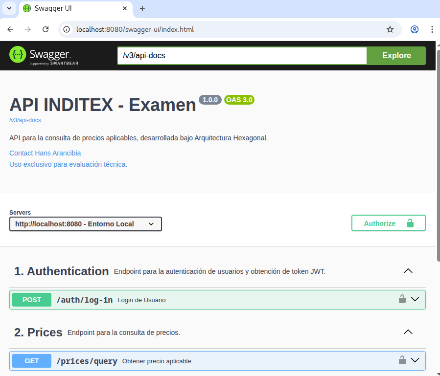
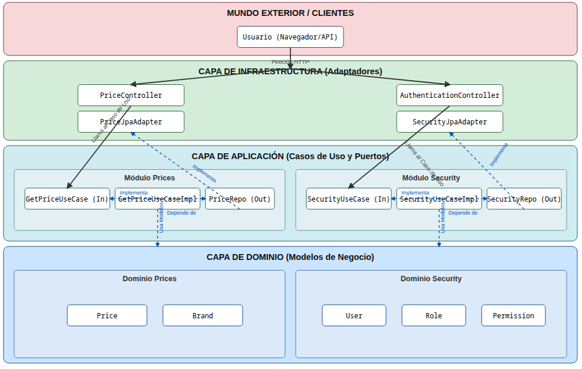
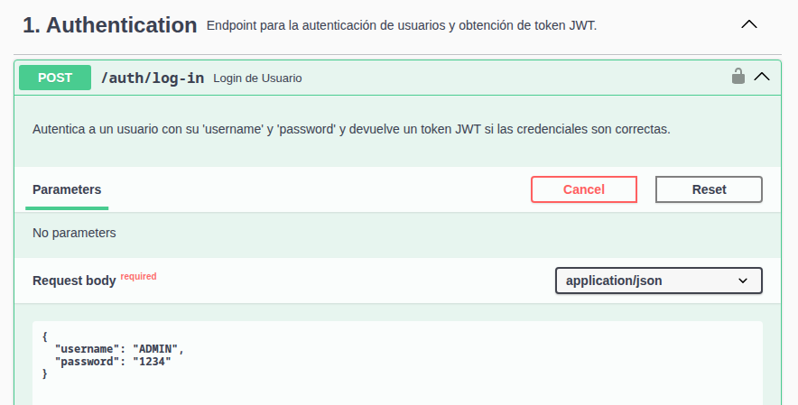
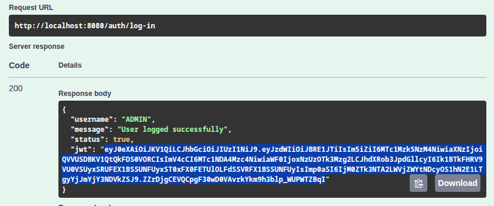
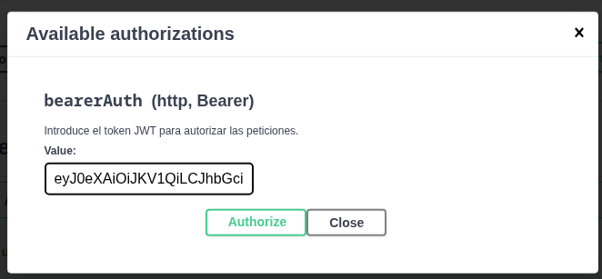
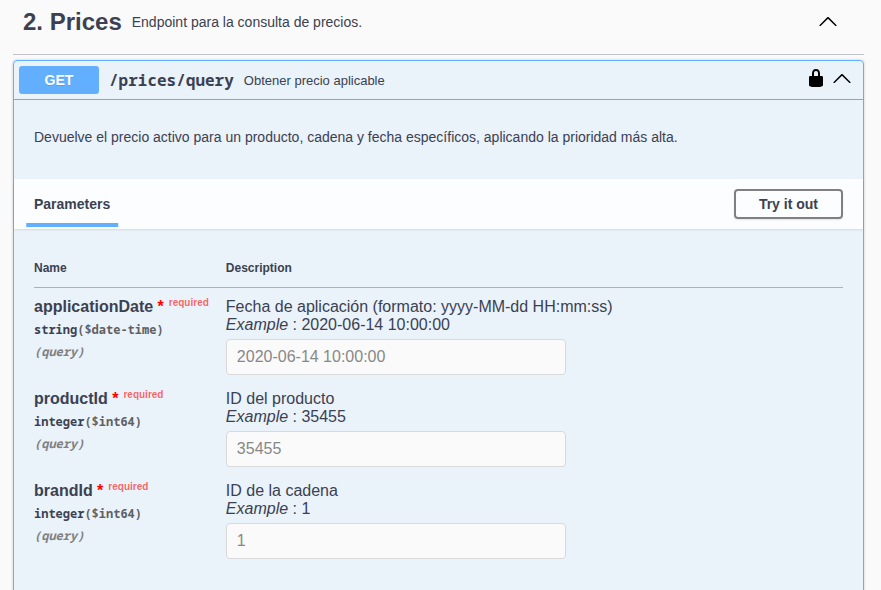
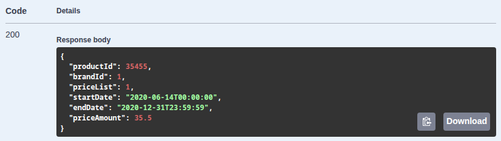
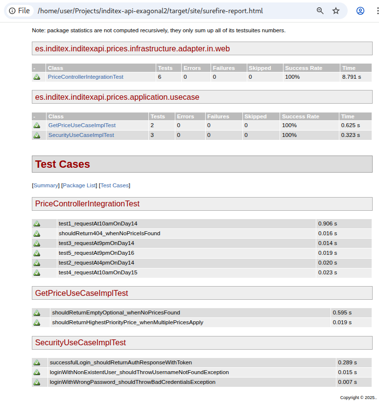
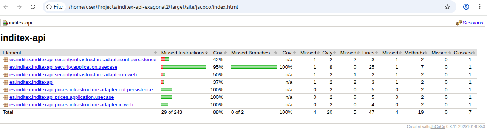

# inditex-api-hexagonal2
PROYECTO EVALUACION BAJO ARQUITECTURA HEXAGONAL v2

# PROYECTO EVALUACION

### Guia del usuario

### Ejecución del servicio
Se debe ejecutar el programa java:<br>
/src/main/es/inditex/inditexapi/InditexApiApplication.java



#### Arquitectura del Proyecto: Diseño Hexagonal Orientado a Dominios

Este proyecto ha sido construido siguiendo los principios de la **Arquitectura Hexagonal (o de Puertos y Adaptadores)**, con un fuerte enfoque en el **Diseño Orientado a Dominios (DDD)** y los principios **SOLID**. El objetivo principal es lograr un núcleo de negocio desacoplado, altamente cohesivo y fácilmente testeable, aislando la lógica de negocio de los detalles técnicos externos como la base de datos o la API web.



La estructura del código está organizada en **dos Contextos Delimitados (Bounded Contexts)** principales, cada uno con su propia estructura hexagonal interna:

1.  **Módulo `prices`**: Responsable de toda la lógica relacionada con la consulta y el cálculo de precios.
2.  **Módulo `security`**: Responsable de la autenticación y autorización de usuarios.

Esta separación modular asegura que las responsabilidades de cada dominio estén claramente definidas y no se mezclen, facilitando el mantenimiento y la escalabilidad futura del sistema.

**Flujo de una Petición (Principio de Inversión de Dependencias):**

El flujo de cualquier petición sigue estrictamente la regla de dependencia, donde las capas externas siempre dependen de las internas, pero nunca al revés:

1.  **Capa de Infraestructura (Adaptadores de Entrada):** Un `@RestController` (como `PriceController`) recibe la petición HTTP. Su única responsabilidad es traducir la petición a un comando simple y llamar al puerto de entrada correspondiente en la capa de aplicación. No contiene lógica de negocio.

2.  **Capa de Aplicación (Puertos y Casos de Uso):**
    *   **Puerto de Entrada (Input Port):** Una interfaz (`GetPriceUseCase`) define el contrato del caso de uso, exponiendo qué puede hacer la aplicación.
    *   **Caso de Uso (UseCase):** Una implementación (`GetPriceUseCaseImpl`) orquesta el flujo. No contiene lógica de negocio compleja, pero sí la secuencia de pasos: validar la entrada, llamar a los puertos de salida para obtener datos y, finalmente, devolver un resultado.
    *   **Puerto de Salida (Output Port):** Una interfaz (`PriceRepository`) define las necesidades de la aplicación hacia el exterior (ej: "necesito que alguien me dé una lista de precios"). El caso de uso depende de esta abstracción, no de una implementación concreta.

3.  **Capa de Dominio (El Núcleo):** Contiene los modelos de negocio puros (`Price`, `User`). Estas clases son agnósticas a cualquier framework, no tienen anotaciones de persistencia ni web. Aquí reside la lógica de negocio más pura y las reglas invariantes del sistema.

4.  **Capa de Infraestructura (Adaptadores de Salida):**
    *   Un adaptador (`PriceJpaAdapter`) implementa el Puerto de Salida (`PriceRepository`). Es el único que sabe hablar con una tecnología específica (en este caso, JPA y H2).
    *   Traduce entre las entidades de dominio y las entidades de persistencia (`@Entity`), asegurando que el núcleo de la aplicación permanezca limpio.

#### Mapeo de Objetos con MapStruct

Para asegurar una conversión de datos eficiente, limpia y libre de errores entre las diferentes capas, se utiliza **MapStruct**. Esta librería genera el código de mapeo en tiempo de compilación, evitando el uso de reflection y garantizando el máximo rendimiento. Se emplean mappers específicos para cada tipo de conversión:

*   **Mappers de Persistencia:** Convierten entre las entidades JPA (Infraestructura) y los modelos de Dominio.
*   **Mappers de Aplicación:** Convierten los modelos de Dominio en DTOs (Data Transfer Objects) para las respuestas de la API.

Esta estrategia garantiza el desacoplamiento total entre las representaciones de datos de cada capa, un pilar fundamental de las arquitecturas limpias.

---

### **Implementación de Seguridad con Spring Security (`/auth/log-in`)**

Como valor agregado, el proyecto incluye un sistema de seguridad completo utilizando **Spring Security**, que también ha sido integrado siguiendo los principios de la **Arquitectura Hexagonal**.

Para poder acceder a los endpoints de negocio (como la consulta de precios), primero es necesario autenticarse. Este proceso garantiza que solo los usuarios autorizados puedan consumir la API.

**¿Cómo Iniciar Sesión?**


1.  Busca el endpoint `POST /auth/log-in` en la documentación de Swagger.
2.  Utiliza las siguientes credenciales de prueba para obtener un token de acceso:
    *   **username:** `ADMIN`
    *   **password:** `1234`
    


3.  El servicio te devolverá una respuesta JSON que contiene un **token JWT**.
4.  Copia este token.



5.  Haz clic en el botón **`Authorize`** (arriba a la derecha en Swagger) y pega el token precedido de la palabra `Bearer ` (ej: `Bearer eyJhbGciOi...`).



Una vez autorizado, se podrá ejecutar las consultas en los demás endpoints de la API.

---

### **Endpoint de Consulta de Precios (`GET /prices/query`)**

Este es el endpoint principal de la aplicación. Su función es determinar qué precio (PVP) aplica para un producto de una cadena en una fecha y hora específicas, resolviendo conflictos de tarifas mediante un sistema de prioridad.

**Parámetros de Entrada:**

El servicio acepta tres parámetros obligatorios en la URL:

*   **`applicationDate`** (fecha y hora): La fecha de consulta.
    *   **Formato:** `yyyy-MM-dd HH:mm:ss` (ejemplo: `2020-06-14 10:00:00`)
*   **`productId`** (número entero): El identificador del producto.
    *   **Ejemplo:** `35455`
*   **`brandId`** (número entero): El identificador de la cadena (ej: 1 para ZARA).
    *   **Ejemplo:** `1`



**Respuesta:**

Si se encuentra un precio aplicable, el servicio devolverá un código de estado `200 OK` y un cuerpo de respuesta en formato JSON con la siguiente estructura:

```json
{
  "productId": 35455,
  "brandId": 1,
  "priceList": 1,
  "startDate": "2020-06-14T00:00:00",
  "endDate": "2020-12-31T23:59:59",
  "priceAmount": 35.5
}
```



En caso de que no se encuentre ningún precio para los parámetros dados, la API devolverá un código de estado `404 Not Found`. Si los parámetros son inválidos, devolverá un `400 Bad Request`.

---

### **Calidad y Pruebas del Software**

Para garantizar la robustez, correctitud y mantenibilidad del proyecto, se ha implementado una estrategia de pruebas exhaustiva, aprovechando las herramientas estándar del ecosistema de Maven y Spring.

#### **Pruebas Unitarias (Mockito)**

Se han desarrollado pruebas unitarias para validar la lógica de negocio de los **Casos de Uso** en completo aislamiento. Utilizando la librería **Mockito**, se simulan las dependencias externas (como los repositorios) para asegurar que el "cerebro" de cada módulo funciona como se espera, sin depender de la base de datos ni de la capa web. Esto nos permite probar reglas de negocio complejas, como la selección del precio por prioridad, de forma rápida y fiable.

#### **Pruebas de Integración (Spring Boot Test & MockMvc)**

Para verificar que todas las capas y componentes de la aplicación funcionan correctamente en conjunto, se han implementado pruebas de integración. Estas pruebas levantan un contexto completo de Spring Boot, incluyendo la base de datos en memoria H2, y utilizan **MockMvc** para simular peticiones HTTP reales a los controladores REST.

Se cubren los 5 casos de prueba solicitados en el enunciado, validando el flujo "end-to-end": desde que la petición llega al `PriceController` hasta que la consulta se resuelve en la base de datos y la respuesta JSON correcta es devuelta.

#### **Ejecución y Reportes (Maven Surefire)**



Todos los tests (tanto unitarios como de integración) están configurados para ser ejecutados automáticamente por el **Plugin Maven Surefire**, el ejecutor de pruebas estándar de Maven. Al ejecutar el comando `mvn test`, Surefire localiza y corre todas las pruebas, garantizando que cualquier cambio en el código que rompa una funcionalidad sea detectado de inmediato.

Además, para una visualización clara y profesional de los resultados, el proyecto está configurado con el **Plugin Maven Surefire Report**. Al ejecutar `mvn site`, se genera un sitio web HTML con un informe detallado que muestra cada test ejecutado y su resultado, facilitando la revisión de la calidad del proyecto.

#### **Análisis de Cobertura (JaCoCo)**

La calidad no solo se mide por si los tests pasan, sino por qué partes del código cubren. Para ello, se ha integrado **JaCoCo (Java Code Coverage)**, una herramienta que analiza qué líneas de código son ejecutadas por las pruebas.

Tras ejecutar `mvn test`, JaCoCo genera un reporte HTML interactivo (ubicado en `target/site/jacoco/index.html`) que colorea el código fuente, mostrando:
*   **Líneas en verde:** Código cubierto por los tests.
*   **Líneas en rojo:** Código no cubierto.



El `pom.xml` ha sido configurado para excluir del reporte los paquetes que no contienen lógica de negocio relevante (como DTOs, entidades o clases de configuración), ofreciendo así una métrica de cobertura **real y significativa** sobre las capas críticas de la aplicación.


